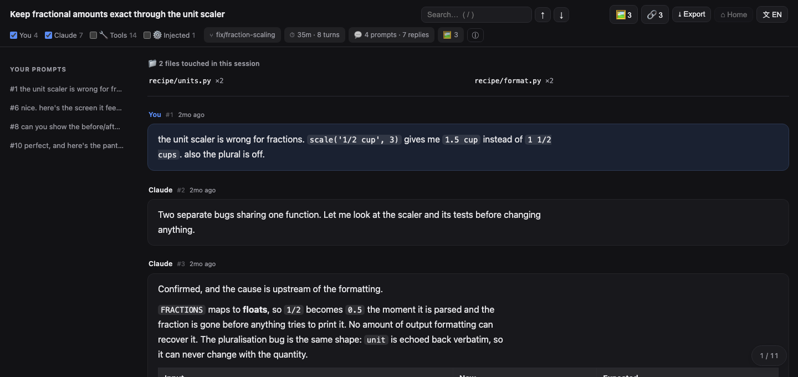

# Claude Transcript Viewer

把一次 Claude Code 的 session 变成一份真正读得下去的 HTML 文件。

[English](README.md) · [繁體中文](README.zh-TW.md) · **简体中文**


### [▶ 打开在线试玩页](https://alexxxtat.github.io/claude-transcript-viewer/)

[](https://alexxxtat.github.io/claude-transcript-viewer/)

一份虚构的 session，已经载好，什么都不用装。那一页跟下面要下载的是同一个文件，所以就算你把
自己的记录拖上去，一样是在浏览器里解析、不会被上传。但真正的记录还是建议用下载版：那份你可以
自己读、自己留着、关掉 Wi-Fi 照跑，比相信一个明天可能被改掉的网页更硬。

Claude Code 会把每一次 session 完整写成 JSONL，存在 `~/.claude/projects/` 下面。那是一份完整的
记录：你输入的每一句话、每一条回复、每一次工具调用、每一张你粘贴过的截图。它同时也完全没法读。一个
14 MB 的 session 是一行一个 JSON 对象，而你真正关心的内容埋在几百个工具结果底下。

## 不用安装任何东西就能试

下载 **`viewer.html`**，打开它，把 `.jsonl` 拖进去。就这样。

一次拖多个、或整个文件夹进去，会先进入列表让你挑，而不是随便打开其中一个。标题栏的 `⌂ Home`
随时可以回去；在一份已转出的文件里它会显示 `↩ Back`，回到那个文件自己的记录，跟重新载入一致。

Markdown 文件也可以拖进去。`.md` 会以文档模式渲染，侧边目录由它自己的标题组成，适合笔记库之外的
那些文件。


还没有自己的记录，或者不想打开真的那份？`demo/sample-session.jsonl` 是专门为这种情况做的虚构
session。把它拖进去，下面列的功能全都是活的：工具调用、注入区块、勾选清单、三张截图、媒体模式。
里面没有任何内容来自真实对话，这也是为什么这一页的截图可以公开。

所有解析都在这一页里完成。没有构建步骤、没有服务器、没有上传，也不会发出任何网络请求。把 Wi-Fi
关掉照样能用。点 **Export** 可以把你正在看的这份记录导出成一个独立的 HTML 文件。

## 或者用 CLI，做浏览器做不到的事

```bash
python3 claude_transcript_viewer.py            # 列出最近 20 个 session
python3 claude_transcript_viewer.py 3          # 转换第 3 个，存到 ~/Desktop
python3 claude_transcript_viewer.py 3 ~/out    # 指定输出目录
python3 claude_transcript_viewer.py --find "定价"      # 搜索全部记录
python3 claude_transcript_viewer.py --find "定价" 3    # 打开第 3 个命中
python3 claude_transcript_viewer.py --agents   # 列表中一并列出 subagent 记录
python3 claude_transcript_viewer.py --build    # 从 src/ 重新生成 viewer.html
python3 claude_transcript_viewer.py --demo-page  # 重新生成在线试玩页
```

CLI 补上浏览器沙箱禁止的事。它会跨所有项目找出你的 session，也会把记录里只用路径引用的截图真正嵌
进去。那些图是在转换的当下从磁盘读出来的，所以就算原文件之后被删，生成的 HTML 仍然完整。

它还会把容易被忽略的 **subagent 记录**摊出来。每一次 `Task` 调用、每一个 workflow agent 都会被单独
记录在 `<session>/subagents/` 下面，有时候还要再深两层，在 `subagents/workflows/<id>/` 里面。在开发
这个工具的那台机器上，主 session 有 783 个，subagent 有 581 个。那几乎是同样份量的历史，格式一模一
样，却没有任何列表会显示给你看。

需要 Python 3.8 以上，只用标准库。

---

## 功能

**阅读**
- 默认只显示干净的对话：你的提问和 Claude 的回复，其他都不出现
- 标题栏带着这个 session 自己生成的标题、git 分支、跑了多久、几个回合。次要数字收在 `ⓘ` 里，
  而不是排成一列九个值
- 侧边目录由你的提问组成（那本来就是天然的章节标记）
- 消息编号（`#12`）同时是永久链接，另有浮动位置指示器与回到顶部
- 相对时间（“3d ago”），悬停显示完整时间
- 每一条消息都有复制按钮，复制的是记录里的原始 markdown 而不是渲染后的文字，所以表格和代码
  块贴到别处仍然完整
- 深色浅色自动跟随系统设置
- 界面支持 English、繁體中文、简体中文。第一次打开时按浏览器语言判断，之后可以从标题栏的
  `文` 切换，选择会记住。繁体和简体是分开写的，不是转换出来的：真正有差别的是用词而不是字，
  比如 檔案/文件、搜尋/搜索、網路/网络

**搜索**
- 页内搜索，实时高亮、命中计数、上一个／下一个
- 按 `/` 聚焦搜索框，`Enter` 与 `Shift+Enter` 逐个跳转
- 命中如果落在折叠或被筛选隐藏的区块里，会自动把那个区块展开

**筛选**
- 筛选栏带实时计数：`You 17 · Claude 166 · 🔧 Tools 577 · ⚙️ Injected 25`
- 工具与注入内容**默认关闭**。想看细节时再打开
- 每一类都能开关，包含你自己的发言，所以可以只读回答或只读提问

**工具调用**
- 连续的调用收成一组：`🔧 12 tool actions · ⚡Bash×7 · 📖Read×3 · ✏️Edit×2`
- 展开一组看单个调用，再展开一个调用看它的输入与结果
- 输入与结果会截断（900 / 1400 字符），避免一份 build log 把整页撑爆
- 记录里有分开存的话，`stdout` 与 `stderr` 会分开显示，被中断的命令也会标明，因为错误和输出
  该用不同方式读
- `TodoWrite` 会渲染成真正的勾选清单


**文件改动**
- 页面顶部一块面板：*“这个 session 动了 41 个文件”*，附每个文件被改了几次
- 打开一份旧 session 时，这通常是你第一个想知道的事

**媒体**
- 截图还原成缩略图，内嵌的 base64 与路径引用的都支持
- **媒体模式**：所有图片排成网格，每张标注它来自哪一条消息
- 灯箱支持 `←` `→`（或滑动）翻页，`Esc`／`Enter`／点背景关闭
- 任何一张图都能**跳回对话**，来源消息会滚动到画面中央并闪一下
- **复制图片**到剪贴板，方便粘贴进以图搜图
- **全部下载**，一次把整个 session 的截图取出来

**链接**
- 这个 session 引用过的每个地址收在 `🔗` 面板里：Markdown 链接、裸网址，以及 `WebFetch` 真的抓过的
  页面（那些平常埋在折叠的工具区块里）
- 每一行都有 `↩ #12` 带你回到引用它的那条消息，跟媒体模式同一条返回路径


**把内容带出去。** `⤓ Export` 提供三种格式
- **HTML**：独立文件，结构与 CLI 的产出完全相同
- **Markdown**：适合放进笔记库或贴进 issue，提问与回复完整保留，工具动作收成一行，注入内容略过
- **PDF**：走浏览器自己的打印对话框。这里没有 PDF 生成器，只有一份打印样式表，把界面元件拿掉、
  不再打印深色背景


---

## 架构

```
viewer.html                     零安装的入口（生成后 commit 进 repo）
claude_transcript_viewer.py     找 session、嵌磁盘截图、注入数据
src/
  viewer.template.html          外壳标记
  viewer.css                    样式
  viewer.js                     ← 解析与渲染只住在这里，只有一份
docs/index.html                 在线试玩页（生成后 commit，由 Pages 供应）
```

`viewer.js` 是唯一的实现。两个入口喂给它同样的记录：拖放页在浏览器里解析 `.jsonl`，CLI 则把
`window.__TRANSCRIPT__` 注入同一个外壳。Python 完全不渲染任何东西，所以两条路径在结构上不可能漂移。

`viewer.html` 由 `--build` 从 `src/` 生成并 commit 进 repo，这样“下载一个文件就能用”才成立。

它读的记录是 **Anthropic Messages API 的形状**，不是 Claude Code 专属格式，这也是为什么 subagent
和 workflow agent 的记录不用多写一行代码就渲染得出来，以及为什么要支持别的助手只需要在
`parseRecords()` 前面接一层 adapter。

其他读同一批文件的工具，以及这个有什么不同：[docs/ALTERNATIVES.md](docs/ALTERNATIVES.md)。

---

## 安全性

会话记录是不可信的输入：别人可以传一份给你。内嵌图片的 `data:` URI 直接来自文件内容，而在修掉之前，
一个精心构造的 `media_type` 可以挣脱 `src` 属性，在那个正显示你对话的页面里执行。
`demo/test_hardening.py` 会在真实浏览器里渲染四个探针并事后检查 DOM，因为静态扫描无法判定一个页面
运行起来会做什么。细节在 [SECURITY.md](SECURITY.md)。

## 限制

- Markdown 渲染刻意做得很少：标题、列表、表格、代码块、行内样式。没有语法高亮，因为那意味着引入
  依赖。
- 截图是内嵌的，输出才自带一切，所以 9 张图的 session 大约 3 MB。
- 浏览器版无法列出你的 session，也无法让文件选择器打开在 `~/.claude/projects` 里面。
  `showDirectoryPicker()` 在任何 `file://` 页面上都会拒绝，因为本地文件是 opaque origin。架在 HTTPS
  上可以解锁，代价是失去这个工具之所以值得用的性质，所以这件事交给 CLI 做。
- 没有一键以图搜图，同一个原因：`data:` URI 不是 Google 抓得到的东西。灯箱改为提供**复制图片**，
  浏览器自己的右键搜索也能直接对缩略图使用。
- 在 macOS 与 Chrome 上测试过。路径假设是 `~/.claude/projects/`。

## 隐私

一切都在本地运行。输出没有任何外部引用，没有 CDN、没有远程字体、没有分析工具。它离线可用，而且会
一直可用。

生成的文件含完整对话，包含截图。`.gitignore` 因此排除了 `claude-*.html`。在你想清楚之前，不要把它
放进任何会自动同步或自动 commit 的地方。

## 发布前

`tools/lint.py` 跑的是人工审阅一直漏掉的那些检查：`viewer.html` 是否仍与 `src/` 一致、有没有任何
来自真实机器的东西即将被 commit、每个控件是否都有事件、文档里提到的控件是否真的存在、以及句子有
没有靠标点撑着而不是靠结构。CI 跑同一个脚本，外加不可信输入探针与可复现构建检查。它强制的惯例列在
[CONTRIBUTING.md](CONTRIBUTING.md)，什么能 commit、什么不能写在
[PUBLISHING.md](PUBLISHING.md)。

```bash
python3 tools/lint.py
```

## 许可

MIT
