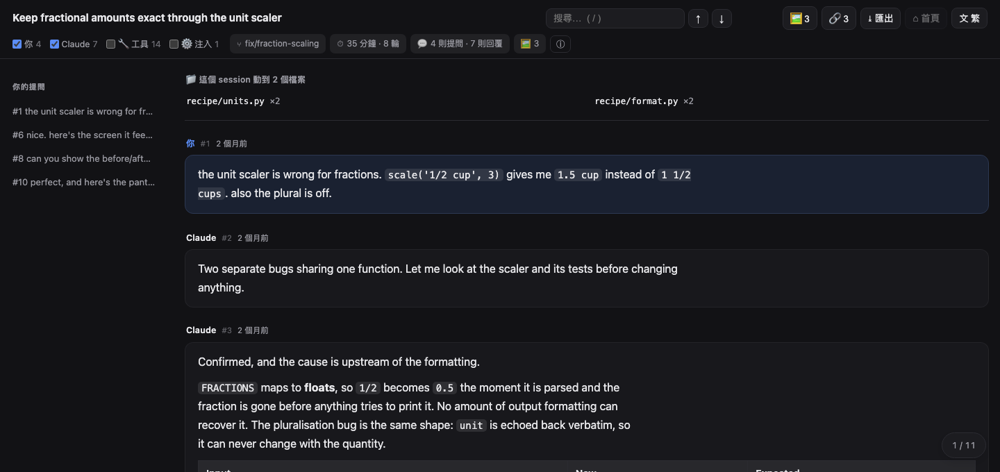
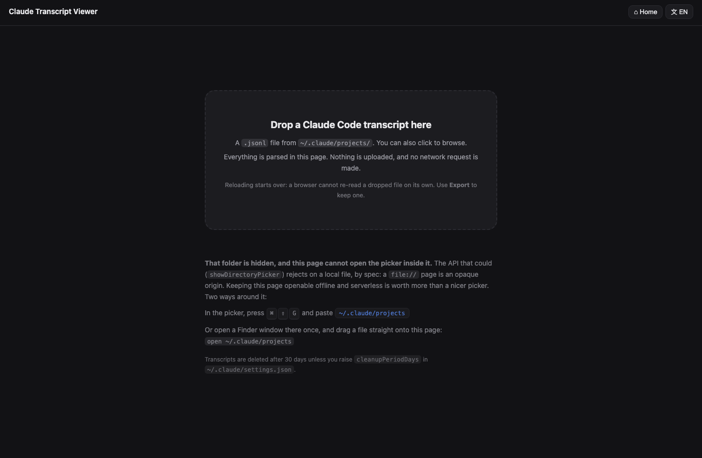
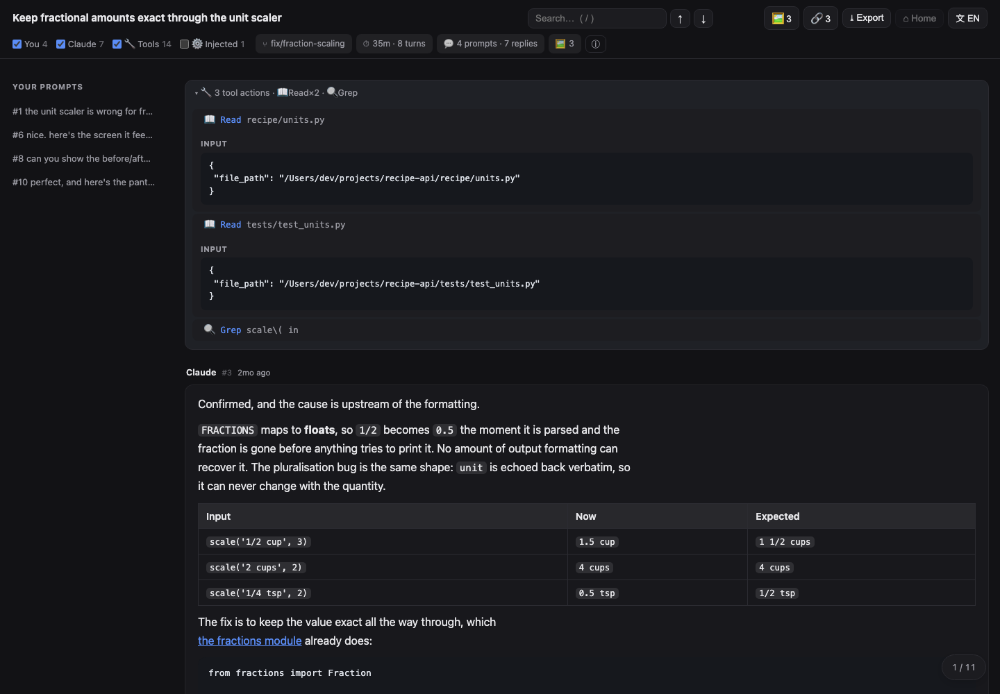
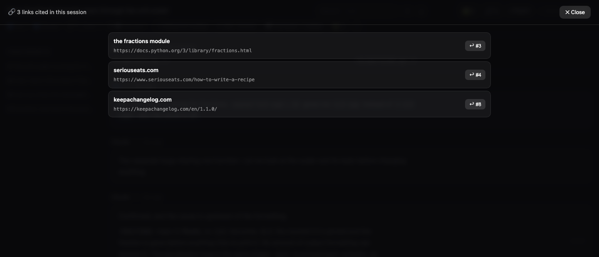
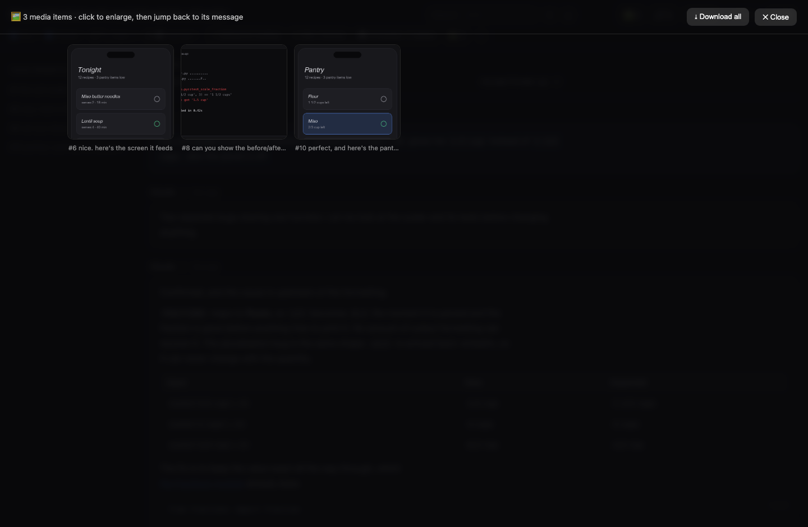

# Claude Transcript Viewer

把一次 Claude Code 的 session 變成一份真的讀得下去的 HTML 檔。

[English](README.md) · **繁體中文** · [简体中文](README.zh-CN.md)


### [▶ 打開線上試玩頁](https://alexxxtat.github.io/claude-transcript-viewer/)

[](https://alexxxtat.github.io/claude-transcript-viewer/)

一份虛構的 session，已經載好，什麼都不用裝。那一頁跟底下要下載的是同一個檔案，所以就算你把
自己的紀錄拖上去，一樣是在瀏覽器裡解析、不會被上傳。但真正的紀錄還是建議用下載版：那份你可以
自己讀、自己留著、關掉 Wi-Fi 照跑，比相信一個明天可能被改掉的網頁更硬。

Claude Code 會把每一次 session 完整寫成 JSONL，存在 `~/.claude/projects/` 底下。那是一份完整的
紀錄：你打的每一句話、每一則回覆、每一次工具呼叫、每一張你貼過的截圖。它同時也完全不能讀。一個
14 MB 的 session 是一行一個 JSON 物件，而你真正在意的內容埋在幾百個工具結果底下。

## 不用安裝任何東西就能試

下載 **`viewer.html`**，打開它，把 `.jsonl` 拖進去。就這樣。

一次拖多個、或整個資料夾進去，會先進入清單讓你挑，而不是隨便開其中一個。標題列的 `⌂ Home`
隨時可以回去；在一份已轉出的檔案裡它會顯示 `↩ Back`，回到那個檔案自己的逐字稿，跟重新載入一致。

Markdown 檔也可以拖進去。`.md` 會以文件模式渲染，側邊目錄由它自己的標題組成，適合筆記庫之外的
那些檔案。



還沒有自己的逐字稿，或者不想打開真的那份？`demo/sample-session.jsonl` 是專門為這種情況做的虛構
session。把它拖進去，下面列的功能全都是活的：工具呼叫、注入區塊、勾選清單、三張截圖、媒體模式。
裡面沒有任何內容來自真實對話，這也是為什麼這一頁的截圖可以公開。

所有解析都在這一頁裡完成。沒有建置步驟、沒有伺服器、沒有上傳，也不會發出任何網路請求。把 Wi-Fi
關掉照樣能用。按 **Export** 可以把你正在看的這份逐字稿存成一個獨立的 HTML 檔。

## 或者用 CLI，做瀏覽器做不到的事

```bash
python3 claude_transcript_viewer.py            # 列出最近 20 個 session
python3 claude_transcript_viewer.py 3          # 轉換第 3 個，存到 ~/Desktop
python3 claude_transcript_viewer.py 3 ~/out    # 指定輸出目錄
python3 claude_transcript_viewer.py --find "定價"      # 搜尋全部逐字稿
python3 claude_transcript_viewer.py --find "定價" 3    # 開啟第 3 個命中
python3 claude_transcript_viewer.py --agents   # 清單中一併列出 subagent 逐字稿
python3 claude_transcript_viewer.py --build    # 從 src/ 重新產生 viewer.html
python3 claude_transcript_viewer.py --demo-page  # 重新產生線上試玩頁
```

CLI 補上瀏覽器沙盒禁止的事。它會跨所有專案找出你的 session，也會把逐字稿裡只用路徑指涉的截圖真的
嵌進去。那些圖是在轉檔當下從磁碟讀出來的，所以就算原檔之後被刪，產出的 HTML 仍然完整。

它也會把容易被忽略的 **subagent 逐字稿**攤出來。每一次 `Task` 呼叫、每一個 workflow agent 都會被
獨立記錄在 `<session>/subagents/` 底下，有時候還要再深兩層，在 `subagents/workflows/<id>/` 裡面。
在開發這個工具的那台機器上，主 session 有 783 個，subagent 有 581 個。那幾乎是同樣份量的歷史，格式
一模一樣，卻沒有任何清單會顯示給你看。

需要 Python 3.8 以上，只用標準函式庫。

---

## 功能

**閱讀**
- 預設只顯示乾淨的對話：你的提問和 Claude 的回覆，其他都不出現
- 標題列帶著這個 session 自己生成的標題、git 分支、跑了多久、幾個回合。次要數字收在 `ⓘ` 裡，
  不是排成一列九個值
- 側邊目錄由你的提問組成（那本來就是天然的章節標記）
- 訊息編號（`#12`）同時是永久連結，另有浮動位置指示器與回到頂端
- 相對時間（「3d ago」），滑過顯示完整時間
- 每一則訊息都有複製鈕，複製的是紀錄裡的原始 markdown 而不是渲染後的文字，所以表格和程式碼
  區塊貼到別處仍然完整
- 深淺色自動跟隨系統設定
- 介面支援 English、繁體中文、简体中文。第一次開啟時依瀏覽器語言判斷，之後可以從標題列的
  `文` 切換，選擇會記住。繁體和簡體是分開寫的，不是轉換出來的：真正有差的是用詞而不是字，
  像 檔案/文件、搜尋/搜索、網路/网络

**搜尋**
- 站內搜尋，即時高亮、命中計數、上一個／下一個
- 按 `/` 聚焦搜尋框，`Enter` 與 `Shift+Enter` 逐一跳轉
- 命中如果落在收摺或被篩選隱藏的區塊裡，會自動把那個區塊展開

**篩選**
- 篩選列帶即時計數：`You 17 · Claude 166 · 🔧 Tools 577 · ⚙️ Injected 25`
- 工具與注入內容**預設關閉**。想看細節時再打開
- 每一類都能開關，包含你自己的發言，所以可以只讀回答或只讀提問

**工具呼叫**
- 連續的呼叫收成一組：`🔧 12 tool actions · ⚡Bash×7 · 📖Read×3 · ✏️Edit×2`
- 展開一組看個別呼叫，再展開一個呼叫看它的輸入與結果
- 輸入與結果會截斷（900 / 1400 字元），避免一份 build log 把整頁撐爆
- 紀錄裡有分開存的話，`stdout` 與 `stderr` 會分開顯示，被中斷的指令也會標明，因為錯誤和輸出
  該用不同方式讀
- `TodoWrite` 會渲染成真正的勾選清單



**檔案異動**
- 頁面頂端一塊面板：*「這個 session 動了 41 個檔案」*，附每個檔案被改幾次
- 打開一份舊 session 時，這通常是你第一個想知道的事

**媒體**
- 截圖還原成縮圖，內嵌的 base64 與路徑指涉的都支援
- **媒體模式**：所有圖片排成網格，每張標註它來自哪一則訊息
- 燈箱支援 `←` `→`（或滑動）翻頁，`Esc`／`Enter`／點背景關閉
- 任何一張圖都能**跳回對話**，來源訊息會捲到畫面中央並閃一下
- **複製圖片**到剪貼簿，方便貼進以圖搜尋
- **全部下載**，一次把整個 session 的截圖取出來

**連結**
- 這個 session 引用過的每個位址收在 `🔗` 面板裡：Markdown 連結、裸網址，以及 `WebFetch` 真的抓過的
  頁面（那些平常埋在收摺的工具區塊裡）
- 每一列都有 `↩ #12` 帶你回到引用它的那則訊息，跟媒體模式同一條返回路徑



**把內容帶出去。** `⤓ Export` 提供三種格式
- **HTML**：獨立檔案，結構與 CLI 的產出完全相同
- **Markdown**：適合放進筆記庫或貼進 issue，提問與回覆完整保留，工具動作收成一行，注入內容略過
- **PDF**：走瀏覽器自己的列印對話框。這裡沒有 PDF 產生器，只有一份列印樣式表，把介面元件拿掉、
  不再印深色背景



---

## 架構

```
viewer.html                     零安裝的入口（產生後 commit 進 repo）
claude_transcript_viewer.py     找 session、嵌磁碟截圖、注入資料
src/
  viewer.template.html          外殼標記
  viewer.css                    樣式
  viewer.js                     ← 解析與渲染只住在這裡，只有一份
docs/index.html                 線上試玩頁（產生後 commit，由 Pages 供應）
```

`viewer.js` 是唯一的實作。兩個入口餵給它同樣的紀錄：拖放頁在瀏覽器裡解析 `.jsonl`，CLI 則把
`window.__TRANSCRIPT__` 注入同一個外殼。Python 完全不渲染任何東西，所以兩條路徑在結構上不可能漂移。

`viewer.html` 由 `--build` 從 `src/` 產生並 commit 進 repo，這樣「下載一個檔案就能用」才成立。

它讀的紀錄是 **Anthropic Messages API 的形狀**，不是 Claude Code 專屬格式。這也是為什麼 subagent
和 workflow agent 的逐字稿不用多寫一行程式就渲染得出來，以及為什麼要支援別的助理只需要在
`parseRecords()` 前面接一層 adapter。

其他讀同一批檔案的工具，以及這個有什麼不同：[docs/ALTERNATIVES.md](docs/ALTERNATIVES.md)。

---

## 安全性

逐字稿是不可信的輸入：別人可以傳一份給你。內嵌圖片的 `data:` URI 直接來自檔案內容，而在修掉之前，
一個精心構造的 `media_type` 可以掙脫 `src` 屬性，在那個正顯示你對話的頁面裡執行。
`demo/test_hardening.py` 會在真實瀏覽器裡渲染四個探針並事後檢查 DOM，因為靜態掃描無法判定一個頁面
執行起來會做什麼。細節在 [SECURITY.md](SECURITY.md)。

## 限制

- Markdown 渲染刻意做得很少：標題、清單、表格、程式碼區塊、行內樣式。沒有語法高亮，因為那表示引入
  相依套件。
- 截圖是內嵌的，輸出才自帶一切，所以 9 張圖的 session 大約 3 MB。
- 瀏覽器版無法列出你的 session，也無法讓檔案選取器開在 `~/.claude/projects` 裡面。
  `showDirectoryPicker()` 在任何 `file://` 頁面上都會拒絕，因為本機檔案是 opaque origin。架在 HTTPS
  上可以解鎖，代價是失去這個工具之所以值得用的性質，所以這件事交給 CLI 做。
- 沒有一鍵以圖搜尋，同一個原因：`data:` URI 不是 Google 抓得到的東西。燈箱改為提供**複製圖片**，
  瀏覽器自己的右鍵搜尋也能直接對縮圖使用。
- 在 macOS 與 Chrome 上測試過。路徑假設是 `~/.claude/projects/`。

## 隱私

一切都在本機執行。輸出沒有任何外部參照，沒有 CDN、沒有遠端字型、沒有分析工具。它離線可用，而且會
一直可用。

產出的檔案含完整對話，包含截圖。`.gitignore` 因此排除了 `claude-*.html`。在你想清楚之前，不要把它
放進任何會自動同步或自動 commit 的地方。

## 發佈前

`tools/lint.py` 跑的是人工審閱一直漏掉的那些檢查：`viewer.html` 是否仍與 `src/` 一致、有沒有任何
來自真實機器的東西即將被 commit、每個控制項是否都有事件、文件裡提到的控制項是否真的存在、以及
句子有沒有靠標點撐著而不是靠結構。CI 跑同一支腳本，外加不可信輸入探針與可重現建置檢查。它強制的
慣例列在 [CONTRIBUTING.md](CONTRIBUTING.md)，什麼能 commit、什麼不能寫在
[PUBLISHING.md](PUBLISHING.md)。

```bash
python3 tools/lint.py
```

## 授權

MIT
